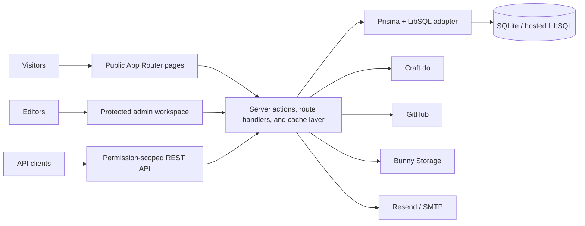

<div align="center">

# ExploreCMS

**A self-hosted publishing platform for writing, projects, and photography.**

Built with Next.js, TypeScript, Prisma, and LibSQL.

[](LICENSE)
[](https://nextjs.org/)
[](https://www.typescriptlang.org/)
[](#deployment)

[Features](#features) · [Quick start](#quick-start) · [Configuration](#configuration) · [REST API](#rest-api) · [Deployment](#deployment)

</div>

ExploreCMS combines an editorial public site with a focused administration workspace. Publish rich articles, present software projects, curate photo albums, customize the visual identity, and automate content through integrations or a permission-scoped API—all while retaining control of the application and its data.

## Features

| Area | What is included |
| --- | --- |
| Publishing | TipTap editor with Markdown storage, slash commands, task lists, code blocks, links, YouTube embeds, image upload, drafts, featured posts, tags, custom slugs, and debounced autosave for existing posts. |
| Reader experience | Editorial layouts, featured and trending content, cursor-based infinite pagination, tag filters, live post search with `Ctrl/Cmd + K`, related posts, reading-time estimates, and responsive light/dark modes. |
| Multilingual content | ISO 639-1 language selection, translation groups, translation creation from the editor, and a reader-facing language switcher. |
| Projects | Manual portfolio management plus GitHub import and sync for public repositories, README content, topics, links, status, and generated cover art. |
| Photo gallery | Publish ordered albums with cover images, photo metadata, featured items, and an accessible keyboard-enabled lightbox. |
| Site composition | Enable Blog, Projects, and Photos independently, choose the homepage section, and build tag-based navigation with dropdowns. |
| Design system | 41 visual themes, per-theme typography, light/dark variants, custom branding and favicon, editorial public surfaces, and an optional interactive particle background. |
| SEO | Site-wide and per-post metadata, canonical URLs, Open Graph/Twitter cards, generated share images, JSON-LD, dynamic `sitemap.xml`, `robots.txt`, search verification, indexing controls, and optional `llms.txt`. |
| Integrations | Craft.do read-only, backup, and full-sync workflows; GitHub project import; Bunny Storage; Resend or SMTP email; and database/storage migration tools. |
| Administration | Analytics overview, post/project/album management, popup announcements, user roles, encrypted integration credentials, and a first-run setup wizard. |
| Developer API | Key-authenticated REST API for posts, projects, albums, photos, and media uploads with granular permissions, expiry, revocation, pagination, rate limits, and idempotent post creation. |

## Technology stack

| Layer | Technology |
| --- | --- |
| Application | Next.js 16 App Router, React 19, TypeScript 5 |
| Editing | TipTap 3 with Markdown and rich-content extensions |
| Data | Prisma 6, `@prisma/adapter-libsql`, SQLite-compatible LibSQL |
| Authentication | Signed JWT sessions with `jose`, password hashing with `bcryptjs` |
| Styling | CSS custom properties, route-scoped CSS, 41 theme definitions |
| Content safety | `sanitize-html`, MIME allowlists, image signature validation |
| Testing | Vitest, jsdom, Testing Library |
| Deployment | Node.js server or serverless hosting with a hosted LibSQL database |

## Quick start

### Prerequisites

- Node.js 20.9 or newer
- npm
- SQLite for local development, or a hosted LibSQL database for deployment

### 1. Install the project

```bash
git clone https://github.com/tunwinlat/ExploreCMS.git
cd ExploreCMS
npm ci
```

### 2. Configure the local environment

Create a `.env` file in the repository root:

```env
DATABASE_URL="file:./dev.db"
JWT_SECRET="replace-with-a-long-random-secret"
ENCRYPTION_KEY="replace-with-another-long-random-secret"
NEXT_PUBLIC_APP_URL="http://localhost:3000"
```

Generate suitable secrets with:

```bash
openssl rand -base64 64
openssl rand -base64 32
```

Environment files are ignored by Git. Keep these values private and use different secrets for each deployment.

### 3. Prepare the local database

```bash
npx prisma generate
npx prisma db push
```

### 4. Start ExploreCMS

```bash
npm run dev
```

Open [http://localhost:3000/setup](http://localhost:3000/setup). The setup wizard creates the single owner account, initializes default site settings, and can optionally configure Bunny Storage. After setup, administration is available at `/admin/dashboard`.

## Configuration

### Environment variables

| Variable | Requirement | Purpose |
| --- | --- | --- |
| `DATABASE_URL` | Required | Local `file:` URL or hosted `libsql://`, `https://`, or `wss://` connection URL. |
| `DATABASE_AUTH_TOKEN` | Hosted databases | Authentication token for the LibSQL provider. |
| `JWT_SECRET` | Required | Signs seven-day HTTP-only admin session cookies. Use a strong random value. |
| `ENCRYPTION_KEY` | Strongly recommended; required for secure production use | Encrypts stored Craft, GitHub, Bunny, email, and database credentials with AES-256-GCM. Do not rotate it without migrating encrypted values. |
| `NEXT_PUBLIC_APP_URL` | Recommended | Absolute application URL used in verification and password-reset emails. |
| `NEXTAUTH_URL` | Optional fallback | Used for email links when `NEXT_PUBLIC_APP_URL` is absent. |

Craft.do, GitHub, Bunny Storage, Resend, and SMTP credentials are configured in the owner dashboard and stored in the database. They do not require separate environment variables.

### Database behavior

Local development uses Prisma against a `file:` database. Run `prisma db push` after schema changes.

Hosted LibSQL deployments are handled differently:

- The setup wizard initializes a new remote database.
- Idempotent production migrations run during application startup.
- Existing installations are upgraded automatically when the application is deployed.
- `prisma migrate deploy` is not required for the hosted runtime path used by this project.

### Media storage

Local uploads are written to `public/uploads`, which is appropriate for local development and persistent Node.js hosts. Serverless filesystems are ephemeral, so configure Bunny Storage before relying on uploads in production.

The upload endpoint accepts validated image formats, enforces a 10 MB size limit, verifies file signatures, and falls back to local storage if Bunny Storage is unavailable.

## Administration

The owner dashboard provides:

- Analytics for total, unique, and per-post views
- Draft, published, featured, tagged, multilingual, and SEO-aware post workflows
- Project and photo-album management
- Theme, branding, homepage, component, navigation, and popup controls
- Craft.do, GitHub, email, database, and storage integrations
- API key lifecycle and permission management
- Owner, administrator, and contributor roles

Most global configuration and credential-management screens are owner-only. Admin routes are protected by signed session cookies and server-side authorization checks.

## REST API

ExploreCMS exposes a JSON API at `/api/v1` for external tools and applications.

| Resource | Endpoints | Permissions |
| --- | --- | --- |
| Posts | `/api/v1/posts`, `/api/v1/posts/{id}` | `posts:read`, `posts:create`, `posts:update`, `posts:delete` |
| Projects | `/api/v1/projects`, `/api/v1/projects/{id}` | `projects:read`, `projects:create`, `projects:update`, `projects:delete` |
| Gallery | Album and photo endpoints under `/api/v1/gallery` | `gallery:read`, `gallery:create`, `gallery:update`, `gallery:delete` |
| Media | `/api/v1/media` image uploads for embedding in post content | `media:create` |

Create a key under **Admin → Management → API Keys**. The plaintext key is shown once and never stored; a SHA-256 hash and short display prefix are retained.

```bash
curl -X POST https://example.com/api/v1/posts \
  -H "Authorization: Bearer ecms_your_key" \
  -H "Idempotency-Key: 018f6f4d-7c2a-7c10-a5b8-1f621b6c9342" \
  -H "Content-Type: application/json" \
  -d '{"title":"Hello API","content":"# Hello","published":true,"tags":["api"]}'
```

See the [complete API reference](docs/api.md) for request schemas, pagination, permissions, response codes, idempotency behavior, and gallery endpoints.

## Integrations

### Craft.do

Connect a Craft API server, choose a folder, and select one of three modes:

- **Read only** imports Craft documents and protects linked posts from local edits.
- **Backup** pushes local posts to Craft.
- **Full sync** imports and exports content, including deletion synchronization.

Synchronization can run manually or in the background after eligible homepage responses. A database-backed lease prevents concurrent sync jobs across instances.

### GitHub

Connect a personal access token to import public repositories as published projects. ExploreCMS maps repository metadata, README Markdown, topics or primary language, homepage links, and archive status into the project model. Linked projects can be refreshed from GitHub later.

See [GitHub integration setup](GITHUB_SETUP.md) for configuration details.

### Email

Choose Resend or a custom SMTP server for email verification and password-reset messages. Provider credentials are stored encrypted when `ENCRYPTION_KEY` is configured.

## Architecture



Public listing pages use a 60-second revalidation window, while mutations explicitly invalidate affected routes and cache tags. Post and project content can be stored as Markdown or HTML and is sanitized before rendering.

### Repository layout

```text
ExploreCMS/
├── prisma/                 # Schema, migrations, and local/hosted DB parity
├── public/                 # Static assets and local uploads
├── src/
│   ├── app/                # Public routes, admin workspace, and APIs
│   ├── components/         # Shared public, admin, editor, and gallery UI
│   ├── lib/                # Auth, data, caching, SEO, sync, and integrations
│   └── middleware.ts       # Admin route protection
├── tests/                  # Shared test setup and integration-focused tests
├── docs/                   # API reference and design documentation
├── SECURITY.md             # Security model and deployment checklist
└── package.json            # Scripts and dependency manifest
```

## Development

| Command | Purpose |
| --- | --- |
| `npm run dev` | Start the development server. |
| `npm run build` | Generate Prisma Client and create a production build. |
| `npm run start` | Start the production server. |
| `npm run lint` | Run ESLint. |
| `npm run test` | Run the Vitest suite once. |
| `npx vitest` | Run tests in watch mode. |
| `npx prisma generate` | Regenerate Prisma Client. |
| `npx prisma db push` | Synchronize a local development schema. |

Source files use strict TypeScript and carry the MPL-2.0 header. Server Components are the default; Client Components are reserved for interactive UI and browser APIs.

## Deployment

[](https://vercel.com/new/clone?repository-url=https%3A%2F%2Fgithub.com%2Ftunwinlat%2FExploreCMS)

For a serverless deployment:

1. Create a hosted LibSQL database with a provider such as Turso or Bunny Database.
2. Deploy the repository and set `DATABASE_URL`, `DATABASE_AUTH_TOKEN`, `JWT_SECRET`, `ENCRYPTION_KEY`, and `NEXT_PUBLIC_APP_URL`.
3. Visit `/setup` on the deployed site to initialize the schema and create the owner.
4. Configure Bunny Storage in the setup wizard or owner dashboard before uploading production media.
5. Set the canonical site URL under **Admin → SEO** to activate absolute canonicals, sitemap URLs, social metadata, and `llms.txt`.

Do not use a `file:` database or local uploads on an ephemeral serverless filesystem. A traditional Node.js host with persistent storage can use both.

## Security

ExploreCMS includes:

- Password hashing with bcrypt and seven-day HS256 sessions
- HTTP-only, `SameSite=Lax`, secure-in-production cookies
- Role checks for protected mutations and owner-only configuration
- AES-256-GCM encryption for stored integration secrets
- Sanitized HTML and Markdown rendering
- Upload authentication, size/type/signature validation, and UUID filenames
- API key hashing, granular permissions, expiry, and revocation
- Rate limits for authentication, uploads, public reads, writes, search, and analytics
- Restrictive response headers and an uploaded-SVG content policy

Review [SECURITY.md](SECURITY.md) before production deployment. Please report suspected vulnerabilities privately rather than opening a public issue.

## Contributing

Issues and pull requests are welcome.

1. Fork the repository and create a focused branch.
2. Add or update tests for behavioral changes.
3. Run `npm run test`, `npm run lint`, and `npm run build`.
4. Keep database changes synchronized across the Prisma schema, Prisma migrations, hosted runtime migrations, setup initialization, and the migration fast-path probe.
5. Open a pull request describing the motivation, implementation, and verification performed.

## License

ExploreCMS is licensed under the [Mozilla Public License 2.0](LICENSE). Modifications to MPL-covered files must remain available under the MPL when distributed.
